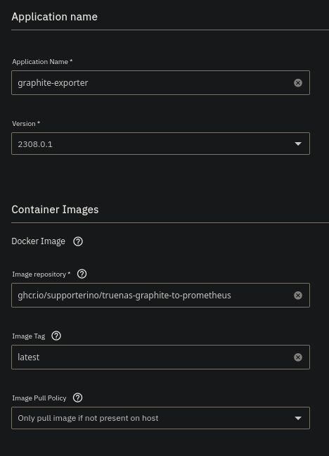
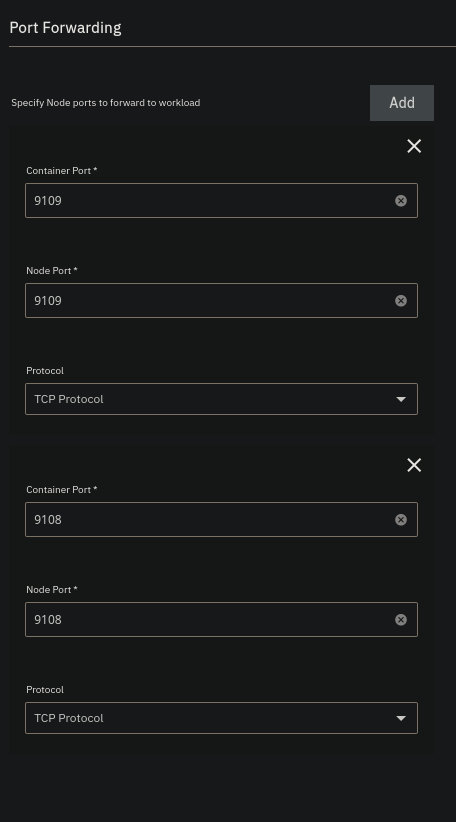

# Running exporter inside truenas

There's no official helm char we can run graphite_exporter with, but we can create our own quite easilly.  
Inside of TrueNAS you have to open the `Apps` tab and then click `Discover Apps` and then `Custom App` to create custom app instead of installing app.
You can name the application how ever you want, use the default version.  
The image to use is `ghcr.io/supporterino/truenas-graphite-to-prometheus` and image tag `latest`. For image policy can be left untouched.  
  
The only other setting you have to change is the port forwarding. Here we have to forward two ports, one for graphite and one for prometheus.
For graphite container port is `9109`, for node port you can choose the same port or specify what ever open port you have. Protocol is `TCP`.
The same for prometheus with container port `9108` and also `TCP` protocol
For example like this.  
  
You can set resource limits, but the exporter is super light weight so it's not necessary.